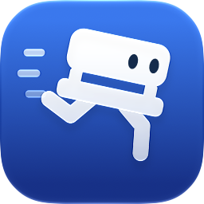

<p align="center">
  <picture>
    <source media="(prefers-color-scheme: dark)" srcset="docs/images/app-icon-dark.png">
    
  </picture>
</p>

<h1 align="center">BenchBar</h1>

<p align="center">Local Frappe and ERPNext benches on your Mac: a CLI that runs them under launchd and a menu bar app to watch them.</p>

<p align="center">
  <a href="https://github.com/askysh/benchbar/releases/latest"></a>
  <a href="https://github.com/askysh/benchbar/actions/workflows/ci.yml"></a>
  
  <a href="LICENSE"></a>
  <a href="https://benchbar.akashmishra.com"></a>
</p>

<p align="center">
  <picture>
    <source media="(prefers-color-scheme: dark)" srcset="docs/images/popover-dark.png">
    
  </picture>
</p>

## Why

BenchBar runs a bench natively, with Python, Node, MariaDB and Redis from
Homebrew and no Docker or VM in between, so file watching, `bench build`
and a debugger run at the Mac's full speed and the setup matches what
most Frappe developers run on Linux. Each bench is a launchd agent: it
keeps running after you close Terminal, comes back after a reboot when it
was running, restarts after a crash and pauses with a notification when
it keeps crashing. When something breaks, `benchbar doctor` names the
exact fix for every problem it finds, and `benchbar repair` applies only
those fixes, in order, with a backup before each change.

## Install

```bash
curl -fsSL https://raw.githubusercontent.com/askysh/benchbar/main/install.sh | bash
```

The installer checks macOS, the Command Line Tools and Homebrew, puts the
CLI in `~/.local/bin` and the app in `~/Applications`, and never runs
`sudo`. Or download the DMG from the
[releases page](https://github.com/askysh/benchbar/releases): the app is
not signed yet, so its [first launch](https://benchbar.akashmishra.com/install/)
needs one trip to Privacy & Security. Or build from source: `git clone`
this repository and run `./benchbar install`; the app needs Xcode 26.

## Quick start

```bash
benchbar adopt ~/frappe-bench     # a bench you already have: shows the plan, then asks
benchbar install                  # or a new bench, site and service from scratch
source ~/.zshrc && benchup        # start it in the background and wait for the site
open http://macdev:8000           # log in as Administrator
```

`adopt` writes only the service files and never runs `migrate`, `build`
or `update`. `install` asks for the site's Administrator password and
keeps a generated MariaDB root password in your Keychain; it asks for
`sudo` once, for the wkhtmltopdf package and the `/etc/hosts` line. After
that you can close Terminal: `benchdown` stops the bench, `benchrestart`
restarts it after Python changes, `benchlogs` follows its log and
`benchwatch` rebuilds assets while you edit them.

The runner in the menu bar sleeps while the bench is stopped, runs while
it is up and stumbles when it crashes. Click it for the popover: start,
stop, restart, open the site or the logs, and a read only doctor. ⌘M
opens the BenchBar window, with a page per bench for its sites, apps and
health. The app never writes to a bench itself; every button runs
`benchbar ... --json` and reads the answer.

## Features

- **One command installs everything:** Homebrew formulae, a MariaDB root password in your Keychain, wkhtmltopdf, a bench and a site.
- **Runs in the background:** one launchd agent per bench, restarted after a crash, paused after three crashes in ten minutes.
- **Doctor and repair:** read only checks that name the fix, then only the flagged fixes, with a backup before each change.
- **A menu bar app:** a runner that shows the state, start and stop, logs, doctor, and a window for each bench's sites, apps and health.
- **Several benches side by side:** a v15 and a v16 bench, each with its own ports, sites and scheduler, on one MariaDB.
- **Apps from anywhere:** the app registry or any GitHub repository, private ones too, with a changelog before every update.
- **Made for teams:** team profiles, the `benchbar.toml` lockfile, and `benchbar pull` for a local copy of production.
- **For coding agents:** `benchbar mcp` lets Claude Code, Cursor and other agents read and drive your benches.


## Documentation

The manual lives at
[benchbar.akashmishra.com](https://benchbar.akashmishra.com). Start with
[Install](https://benchbar.akashmishra.com/install/) for the requirements,
every installer flag and the first launch of an unsigned app. Read
[The menu bar app](https://benchbar.akashmishra.com/app/) for the popover,
the BenchBar window and the keyboard shortcuts. Keep
[Doctor and repair](https://benchbar.akashmishra.com/guides/doctor-and-repair/)
at hand: it lists every check with what it looks at and how it is fixed.
[Teams](https://benchbar.akashmishra.com/guides/teams/) covers team
profiles, the lockfile and pulling a copy of production. Every command
has a reference page, and the JSON the app reads is a documented API.
The same pages are plain markdown in [docs/](docs/), so they read fine on
GitHub too, and `benchbar docs` opens them from the terminal.

## Roadmap

0.6 brings Developer ID signing, a Homebrew cask and in app updates; the rest is in [ROADMAP.md](ROADMAP.md).

## Contributing

Issues and pull requests are welcome: read [CONTRIBUTING.md](CONTRIBUTING.md) first.
For a bug, attach the zip from `benchbar report`; it has no secrets, paths or names.

## Security

Report a vulnerability privately through [GitHub security advisories](https://github.com/askysh/benchbar/security/advisories/new); [SECURITY.md](SECURITY.md) says what counts.

## License

MIT, see [LICENSE](LICENSE). Frappe and ERPNext are trademarks of Frappe
Technologies; BenchBar is not affiliated with or endorsed by them.
