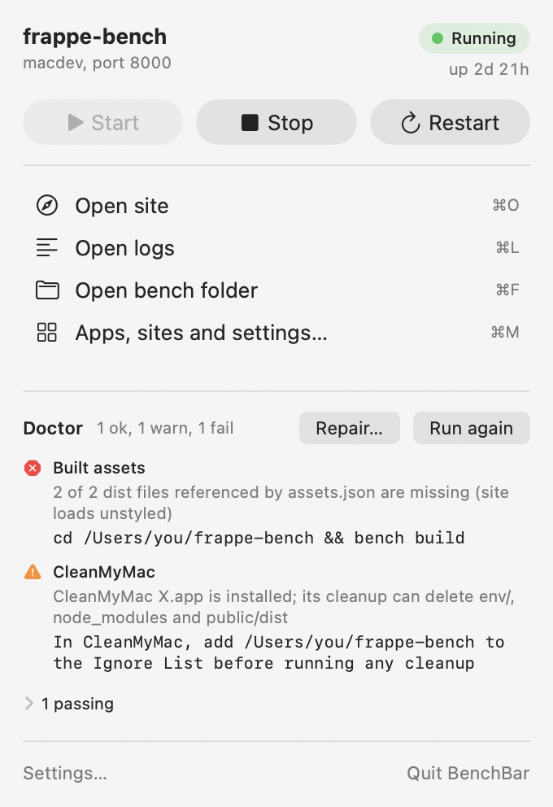
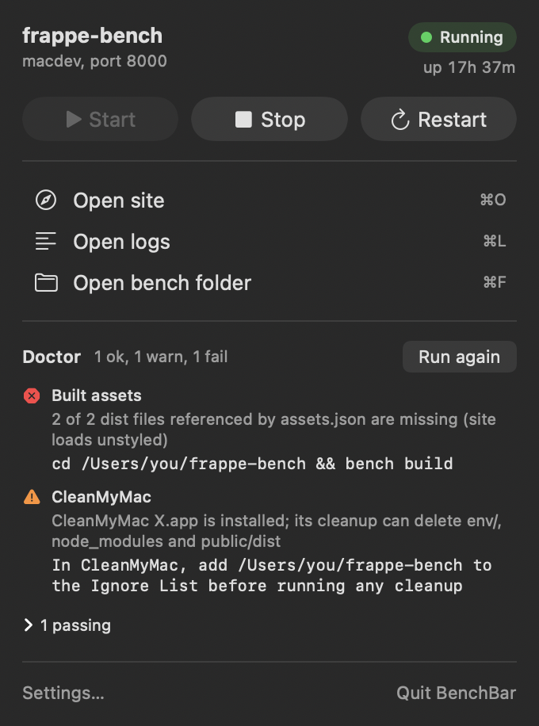
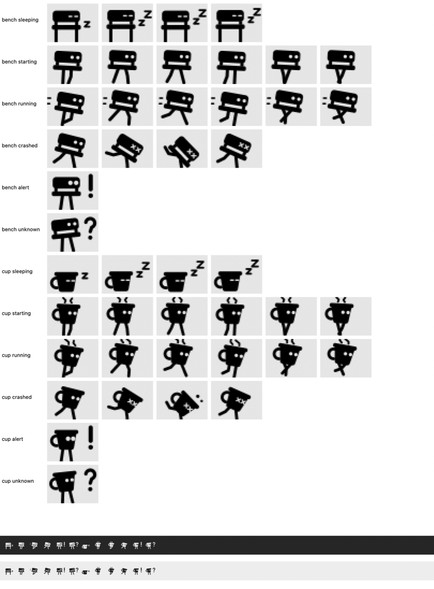

# BenchBar

Local Frappe and ERPNext development benches on macOS. The `benchbar`
command line tool installs a bench, runs it in the background under
launchd and keeps it healthy. The BenchBar menu bar app shows each bench
as a small runner with start, stop and a health check one click away.

[](https://github.com/askysh/benchbar/actions/workflows/ci.yml)
[](https://github.com/askysh/benchbar/releases/latest)
[](LICENSE)


<p>
  
  
</p>

## Features

- **One command installs everything.** Homebrew formulae (Python, Node,
  MariaDB, Redis), a MariaDB root password kept in your Keychain, the
  patched Qt wkhtmltopdf, a bench and a site. Re-running it changes only
  what changed.
- **The bench runs in the background.** One launchd agent per bench. It
  survives closing Terminal, comes back after a reboot if it was running,
  restarts after a crash, and pauses with a notification after three
  crashes in ten minutes.
- **Doctor and repair.** `benchbar doctor` is read only and names the
  exact fix for each problem. `benchbar repair` applies only the flagged
  fixes, in order, with a backup before every change.
- **Existing benches welcome.** `benchbar adopt` registers a bench you
  already have without touching its apps, sites or databases.
- **A menu bar app.** State at a glance, start, stop, restart, the site,
  the logs, a read only doctor, and crash notifications. The app never
  writes to a bench itself; it runs the CLI and reads its JSON.
- **Shell helpers.** `benchup`, `benchdown`, `benchrestart`,
  `benchstatus`, `benchlogs`, `benchwatch` and friends.
- **Bug reports without secrets.** `benchbar report` writes a redacted
  diagnostics zip.

## Requirements

- macOS 14 or later on Apple Silicon. On Intel Macs the CLI works and the
  app is skipped.
- Homebrew and the Xcode Command Line Tools. The installer offers both.
- About 5 GB of free disk under your home folder, and internet access.

No Docker, no VM, no preinstalled Python, Node, MariaDB or Redis.

## Install

```bash
curl -fsSL https://raw.githubusercontent.com/askysh/benchbar/main/install.sh | bash
```

The installer checks macOS, the Command Line Tools and Homebrew, clones
the CLI into `~/.local/share/benchbar` with links in `~/.local/bin`, adds
that folder to `~/.zshrc`, and installs the BenchBar app from the latest
release into `~/Applications` after checking its sha256. It then offers
`benchbar adopt` for a bench it finds, or `benchbar install`. It never
runs `sudo`. Flags: `--yes`, `--dry-run`, `--no-app`, `--app-only`,
`--version vX.Y.Z`, `--uninstall`.

### The app from the DMG

Download `BenchBar-<version>.dmg` from the
[releases page](https://github.com/askysh/benchbar/releases), open it and
drag BenchBar to Applications. The app is not yet signed with an Apple
Developer ID, so macOS 15 and later stop the first launch:

1. Double click BenchBar. A dialog says "BenchBar" Not Opened: Apple
   could not verify it is free of malware. Click **Done**. The highlighted
   button is **Move to Trash** (Move to Bin in British English), so do not
   press Return.
2. Open **System Settings > Privacy & Security**, scroll to the Security
   section: "BenchBar was blocked to protect your Mac".
3. Click **Open Anyway**, confirm with your password or Touch ID, then
   **Open Anyway** once more.

This happens once. The one line installer avoids it, because `curl` sets
no quarantine flag on the download. Verify a download with
`shasum -a 256 -c SHA256SUMS` from the same release.

### From source

```bash
git clone https://github.com/askysh/benchbar.git && cd benchbar
./benchbar install                 # the CLI needs nothing else
brew install xcodegen
scripts/release-local.sh           # the app: dist/BenchBar-<version>.zip and .dmg
scripts/macos-install-local.sh     # or build it and copy it to ~/Applications
```

The app needs full Xcode 26 or newer.

## Quick start

You already have a bench:

```bash
benchbar doctor --bench-dir ~/frappe-bench   # read only
benchbar adopt ~/frappe-bench                # shows its plan and asks
```

You have no bench yet:

```bash
benchbar install
```

`install` runs three phases with a live step list: system dependencies,
bench and site, background service. It asks for two passwords, the
MariaDB root password (generated unless you set `MARIADB_ROOT_PASSWORD`,
kept in your Keychain) and the site's Administrator password (or
`ADMIN_PASSWORD`). It asks for `sudo` once, only when a step ahead needs
it: the wkhtmltopdf package and the `/etc/hosts` line.

Then:

```bash
source ~/.zshrc
benchup
open http://macdev:8000
```

Log in as `Administrator` and walk through the setup wizard. You can
close Terminal; the bench keeps running.

## Daily use

| Helper | Same as | What it does |
|---|---|---|
| `benchup` | `benchbar up` | Start the bench in the background and wait for the site |
| `benchdown` | `benchbar down` | Stop it and keep it stopped, also across reboots |
| `benchrestart` | `benchbar restart` | Restart every process. Needed after Python changes |
| `benchstatus` | `benchbar status` | Agent state, pid, last exit code, stop flag, site ping |
| `benchlogs` | `benchbar logs` | Follow `logs/bench.log`. Flags: `--worker`, `--previous`, `--no-follow` |
| `benchfg` | `benchbar fg` | Stop the service and run honcho in the foreground |
| `benchwatch` | `benchbar watch` | `bench watch` for JS and CSS rebuilds |
| `benchdoctor` | `benchbar doctor` | Read only health report |
| `benchcd` | `cd "$(benchbar path)"` | Jump into the bench folder |

The lean Procfile runs Redis, the web server, socketio and one worker. It
has no watcher and no scheduler: run `benchwatch` while you edit assets,
and `bench schedule` by hand when you need scheduled jobs.

Other commands: `benchbar list`, `benchbar report`,
`benchbar mariadb-password`, `benchbar service`,
`benchbar autostart on|off`, `benchbar uninstall-service`,
`benchbar --help`.

## The menu bar app

The runner in the menu bar sleeps when the bench is stopped, walks while
it starts, runs while it is up (faster when the bench is busy), stumbles
when it crashes, and shows a question mark when the CLI is missing.
Reduce Motion shows still poses. Click it for the popover: bench, site,
state and uptime, Start, Stop, Restart, open the site, the logs or the
bench folder, and a read only doctor. Keyboard: ⌘U start, ⌘D stop,
⌘R restart, ⌘O site, ⌘L logs, ⌘F folder, ⌘K doctor.

On first run the app looks for the CLI in `~/.local/bin/benchbar`, then in
Homebrew's folders, and asks once with a file picker if it finds none.
macOS asks whether BenchBar may send notifications; allow it for the
crash alerts. Settings has two built in runners with a live preview,
custom runners ([docs/runners.md](docs/runners.md)), launch at login,
notifications and the CLI path.

The app does not write plists, edit bench files, or run `bench`, `brew`
or `launchctl`. Every button runs `benchbar ... --json` and reads the
answer, plus the state file the runner writes on every transition. That
JSON is a documented API: [docs/json-schema.md](docs/json-schema.md).



## Doctor and repair

```bash
benchbar doctor              # read only, exit 1 when something fails
benchbar repair --dry-run    # show the plan, change nothing
benchbar repair              # apply, with a confirmation prompt
```

Doctor checks the Homebrew formulae, the bench env, `bench version`, the
socket.io module, the built assets that `assets.json` references, honcho,
`Procfile.lean`, the runner, the launchd agent and its last exit code,
the stop flag, the shell helpers, legacy agents, the MariaDB bind address
and charset config, the PDF engine (wkhtmltopdf, and on v16 the Chromium
frappe can use), a stray Homebrew Redis on 6379, Full Disk Access for
`crontab`, the toolchain as the bench sees it (Node, yarn, the MariaDB
server, pkg-config), honcho without `pkg_resources`, the fork safety
variables, stale processes on the bench's ports, the site
ping, `/etc/hosts`, log sizes, CleanMyMac, and port clashes with other
benches. Every warning and failure names its fix.

Repair runs only the flagged fixes, in dependency order. A broken `env/`
is moved to `env.broken.<timestamp>`, never deleted. The most common case,
a cleanup tool that removed `env/`, `node_modules` and the built assets,
is covered in [docs/troubleshooting.md](docs/troubleshooting.md).

## Configuration

Point the tool at any bench once with `--bench-dir`; the path is
remembered. Without it, benchbar looks for a remembered bench, then
`~/frappe-bench`, `~/dev/frappe-bench`, and any folder under `~` or
`~/dev` that holds `sites/common_site_config.json`. Several benches work
side by side, each under its own agent `com.benchbar.<folder>`.

**Profiles** pick the Frappe branch and the matching toolchain:

| Profile | Frappe | ERPNext | Python | Node | MariaDB |
|---|---|---|---|---|---|
| `v15-lts` (default) | `version-15` | `version-15` | `python@3.11` | `node@20` | `mariadb@10.11` |
| `v16-lts` (experimental) | `version-16` | `version-16` | `python@3.14` | `node@24` | `mariadb@11.8` |

Every profile also installs `pkgconf` (pkg-config) and
`mariadb-connector-c`, which `mysqlclient` needs to build on v16. When
`uv` is on PATH, `bench` itself is installed with `uv tool install
frappe-bench`, as the Frappe docs now recommend; an existing pipx install
is kept, and doctor says which one owns `bench`.

**App bundles** pick what `install` adds beyond Frappe: `minimal`
(`erpnext`), `common` (`erpnext hrms payments`), `extended` (`erpnext hrms
payments crm helpdesk insights`). Definitions live in `config/`.

```bash
benchbar install --profile v16-lts --bundle common
MARIADB_ROOT_PASSWORD='...' ADMIN_PASSWORD='...' benchbar install --yes   # non interactive
benchbar autostart off                                                  # never start at login
```

`--yes` accepts every default and confirmation, including the `sudo` line
for `/etc/hosts`, and expects the passwords in the environment.

**Passwords**

| What | Where it lives | When you need it |
|---|---|---|
| MariaDB root | your Keychain, item `benchbar-mariadb`; `benchbar mariadb-password` prints it after a confirmation | rarely: another `bench new-site`, or `mariadb -u root -p` |
| Administrator | you choose it in phase 2, or `ADMIN_PASSWORD` | every login at `http://macdev:8000` |

## Safety

- Every command is check, plan, apply, verify. `--dry-run` prints the
  full plan and changes nothing. A second run says `unchanged`.
- Generated files carry a version and content hash header. They are
  rewritten only when their template or inputs changed, and the previous
  copy goes to `.benchbar/backups/<timestamp>/` first.
- `sites/`, databases, `apps/` and your own files are never touched.
  Broken folders are moved aside, never removed.
- Stop and cleanup match only this bench's processes and port listeners.
  Your own `bench migrate` or `bench console` keeps running.
- `sudo` is used for two things, the `/etc/hosts` line and the
  wkhtmltopdf package, once per run and only after saying why.
- The MariaDB root password lives in the Keychain and reaches the client
  through `MYSQL_PWD`, never on a command line.
- Full logs of every mutating run: `.benchbar/logs/<timestamp>.log`.

## Uninstall

```bash
benchbar uninstall-service     # remove the agent, runner, Procfile.lean and helpers; keep the bench
curl -fsSL https://raw.githubusercontent.com/askysh/benchbar/main/install.sh | bash -s -- --uninstall
```

The second line removes the app, the links and the PATH block, and offers
to remove the agents and the checkout. Benches, sites and databases are
never deleted by benchbar; the recipe for wiping one by hand is in
[docs/troubleshooting.md](docs/troubleshooting.md).

## Documentation

- [docs/troubleshooting.md](docs/troubleshooting.md): common stumbles, the
  cleanup tool case, what recovers on its own, migrating from frappe-mac
  0.2, what benchbar writes, wiping a bench.
- [docs/testing.md](docs/testing.md): the ten minute guide for testers.
- [docs/json-schema.md](docs/json-schema.md): the JSON the app and scripts
  read.
- [docs/runners.md](docs/runners.md): custom runners for the menu bar.
- [docs/releasing.md](docs/releasing.md): how releases are built and signed.
- [docs/DECISIONS.md](docs/DECISIONS.md): every non obvious choice, one
  line each.
- [AGENTS.md](AGENTS.md): guidance for AI coding agents working on a
  bench.
- [CHANGELOG.md](CHANGELOG.md) and [ROADMAP.md](ROADMAP.md).

## Contributing

Issues and pull requests are welcome. For a bug, attach the zip from
`benchbar report`; it contains no secrets, paths or names.

```bash
tests/run-tests.sh              # the CLI, under mocks; shellcheck when installed
scripts/macos-build.sh --test   # the app and its Swift tests
```

Shell code targets macOS `/bin/bash` 3.2 with no dependencies beyond the
ones the installer needs, passes shellcheck, and every command stays
idempotent: a second run changes nothing and says so. CI runs the suite
on macOS and Linux, builds the app, and uploads an unsigned bundle for
every pull request.

## License

MIT, see [LICENSE](LICENSE). Frappe and ERPNext are trademarks of Frappe
Technologies; BenchBar is not affiliated with or endorsed by them.
