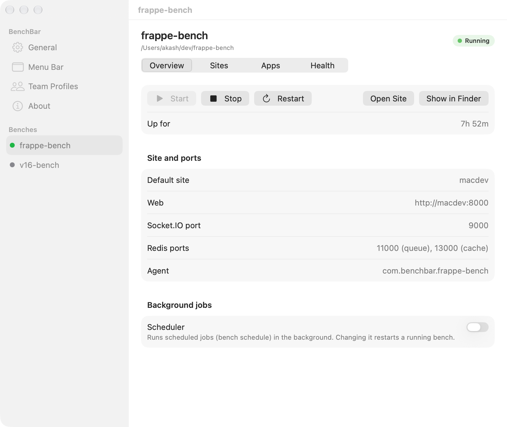
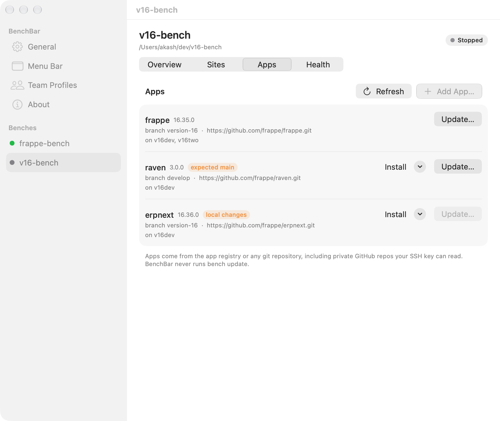
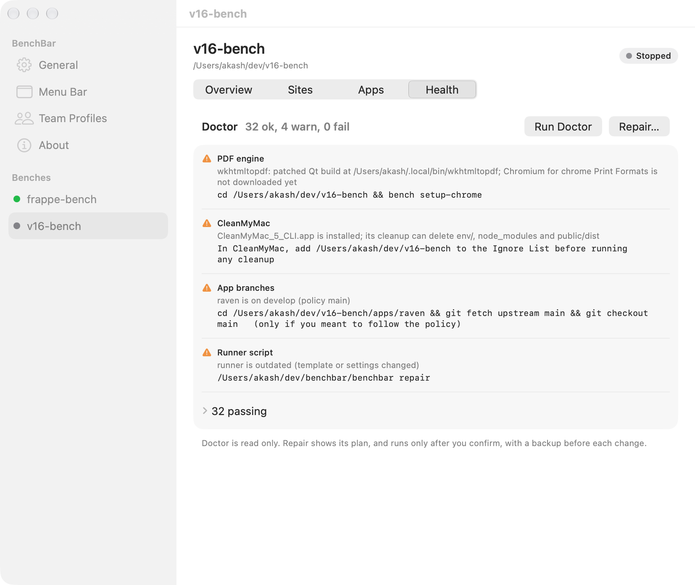
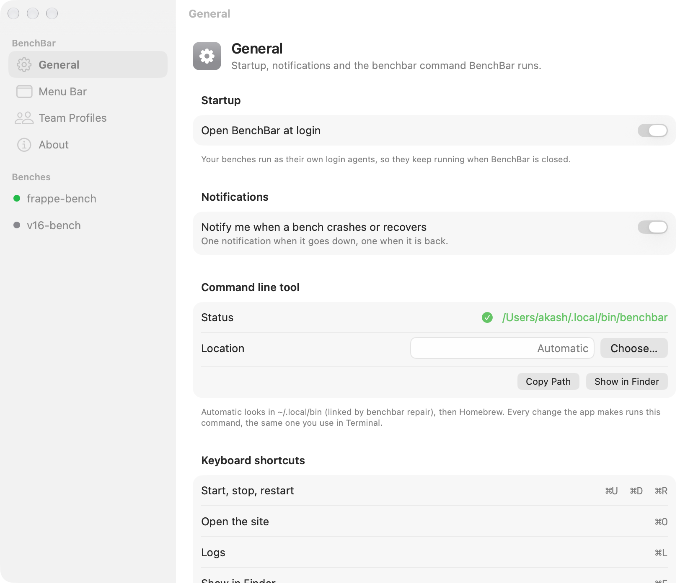

The BenchBar app lives in the menu bar. It shows every bench as a small
runner, and a window with a page per bench for its sites, apps and
health. It installs with the [one line installer](install.md) or from the
[DMG](install.md#the-app-from-the-dmg).

## The runner

The runner in the menu bar sleeps when the bench is stopped, walks while
it starts, runs while it is up (faster when the bench is busy), stumbles
when it crashes, and shows a question mark when the CLI is missing.
Reduce Motion shows still poses. With more than one bench it shows the
worst state of all of them.

BenchBar ships two runners, Bench and Coffee cup, and you can draw your
own: see [Custom runners](runners.md).

## The popover

Click the runner for the popover: bench, site, state and uptime, Start,
Stop, Restart, open the site, the logs or the bench folder, and a read
only doctor with Repair when something is repairable. With more than one
bench the popover lists every bench with its own buttons and an "n of m
up" count.

### Keyboard shortcuts

| Keys | Action |
|---|---|
| ⌘U | Start |
| ⌘D | Stop |
| ⌘R | Restart |
| ⌘O | Open the site |
| ⌘L | Logs: a log window with search and a filter per process |
| ⌘F | Open the bench folder |
| ⌘K | Doctor |
| ⌘M | The BenchBar window |

## The BenchBar window

Open it with ⌘M, "Apps, sites and settings…" in the popover, or by
opening BenchBar again from Finder or Spotlight. It has a page per bench:

- **Overview**: start, stop, restart, the site and ports, and the
  scheduler switch.
- **Sites**: add a site (it asks for the Administrator password), make
  one the default, open any of them.
- **Apps**: add an app from the registry or any GitHub URL, install it on
  a site, and update it after reading the changelog. Right click a bench
  in the sidebar for its actions.
- **Health**: doctor's checks, and Repair with its plan shown before
  anything changes and each step as it runs.

Above the benches:

- **General**: open at login, notifications, which `benchbar` the app
  runs, the keyboard shortcuts.
- **Menu Bar**: the runner, with a live preview and custom runners, see
  [Custom runners](runners.md).
- **Team Profiles**: see [Teams](guides/teams.md#team-profiles).
- **About**.

## First run

On first run the app looks for the CLI in `~/.local/bin/benchbar`, then in
Homebrew's folders, and asks once with a file picker if it finds none.
macOS asks whether BenchBar may send notifications; allow it for the
crash alerts.

## What the app does not do

The app does not write plists, edit bench files, or run `bench`, `brew`
or `launchctl`. Every button runs `benchbar ... --json` and reads the
answer, plus the state file the runner writes on every transition. That
JSON is a documented API: [JSON schema](json-schema.md).
