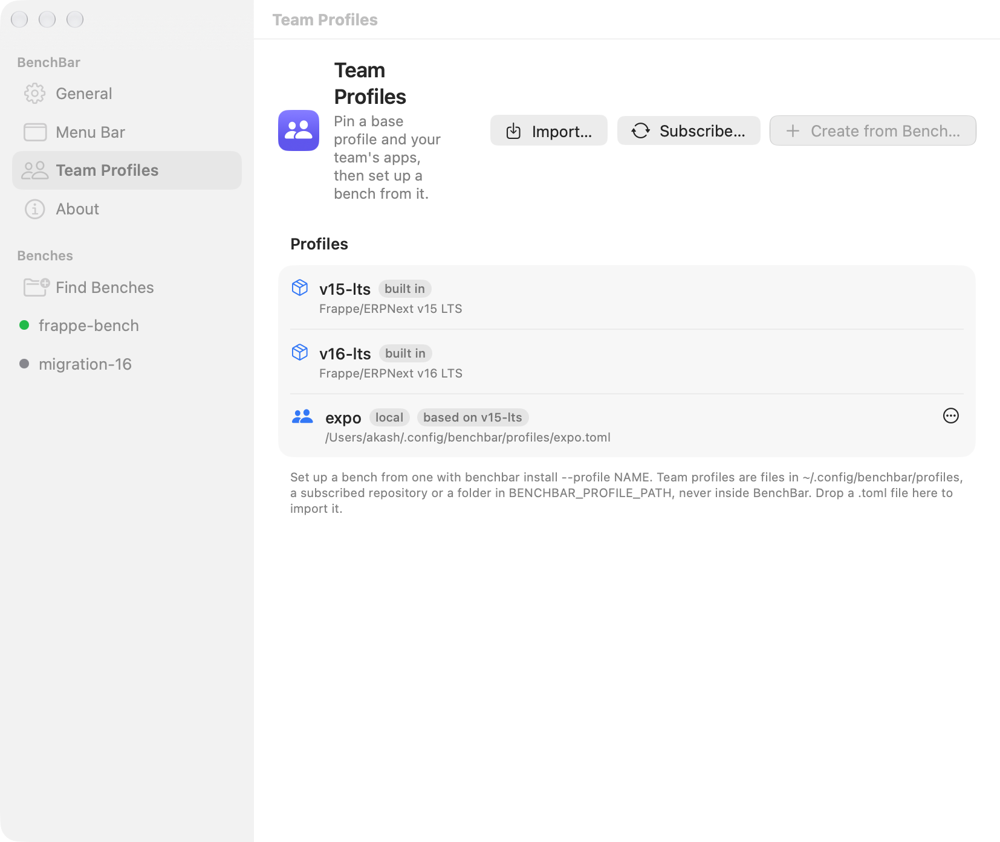

The BenchBar app lives in the menu bar. It shows every bench as a small
runner, and a window with a page per bench for its sites, apps and
health. It installs with [Homebrew](install.md#homebrew) (the
`benchbar-app` cask), the
[one line installer](install.md#the-one-line-installer) or the
[DMG](install.md#the-app-from-the-dmg), and carries its own copy of
the CLI (see [The command line tool inside the
app](#the-command-line-tool-inside-the-app)).

## The runner

The runner in the menu bar sleeps when the bench is stopped, walks while
it starts, runs while it is up (faster when the bench is busy), stumbles
when it crashes, and shows a question mark when the CLI is missing.
Reduce Motion shows still poses. With more than one bench it shows the
worst state of all of them.

BenchBar ships two runners, Bench and Coffee cup, and you can draw your
own: see [Custom runners](runners.md).

## The popover

Click the runner for the popover: bench, site, state and uptime, Start,
Stop and Restart, the logs and the bench folder, the bench's sites with
an Open button each, and a health summary: the first checks that need
attention with a Copy Fix button, Repair when something is repairable,
and a button to check again. With more than one bench a picker at the
top chooses which bench the popover shows.

### Keyboard shortcuts

| Keys | Action |
|---|---|
| ⌘U | Start |
| ⌘D | Stop |
| ⌘R | Restart |
| ⌘O | Open the site |
| ⌘L | Logs: a log window with search and a filter per process |
| ⌘F | Open the bench folder |
| ⌘K | Health in the BenchBar window |
| ⌘M | The BenchBar window |

## Links for Raycast and Shortcuts

`benchbar://up`, `down`, `restart`, `open`, `logs`, `window`, `doctor`,
`console`, `db` and `editor` act on a bench from Raycast, Shortcuts or a script, for example
`open "benchbar://restart?bench=frappe-bench"`. Links never repair,
install or delete anything. The [URL scheme](/reference/url-scheme/) page
has every route and ready to use Raycast and Shortcuts recipes.

## The BenchBar window

Open it with ⌘M, **Manage Bench…** in the popover, or by
opening BenchBar again from Finder or Spotlight. The sidebar lists your
benches first, each with its state dot and its sites beneath it (a site
opens the bench's Sites tab), then **Team Profiles** and **Find
Benches**. The **+** at the bottom of the sidebar has **New Bench…**,
**Adopt Existing Bench…** and **Find Benches…**. On a Mac with no bench
the window opens on the [first run wizard](#a-new-bench-from-the-app).
Every bench has a page:

- **Overview**: start, stop and restart (one group of buttons), **Open
  Site**, the site and ports, and the scheduler switch. **Open in VS
  Code** (or Cursor, chosen in Settings, General) opens the bench folder.
  The ⋯ menu beside Open Site has **Open Console** and **Open Database**
  (Terminal with `benchbar console` and `benchbar db` for the default
  site), Show in Finder and Copy Path. The ⋯ menu of each site on the
  Sites tab has both for that site. **Port Settings & Setup…** sits in
  the header of the Site and ports section. While the bench runs, two small charts show its CPU
  and memory for the last ten minutes (hover for the value at a moment);
  the popover shows the current values under the bench name. They count
  the bench's own processes, not the shared MariaDB, and are kept in
  memory only. A bench with a lockfile (`benchbar.toml`) shows **In
  sync** or **N differences** with the list, from `benchbar lock check`
  (read only); bring it in line with `benchbar lock apply` in Terminal.
- **Sites**: add a site (it asks for the Administrator password) and open
  any of them. The ⋯ menu of a site makes it the default, backs it up
  (with or without files) and shows the last backup in Finder. **Drop
  Site…** deletes the site's database and database user for good; only
  the backup bench takes first (with files) can bring it back. The sheet
  shows that plan, asks you to type the site name, and reports where the
  backup went: the site folder with it moves to `archived/sites/` in the
  bench. The default site can be dropped only by naming the site that
  takes its place, and the only site of a bench cannot be dropped. Removing the site's `/etc/hosts` line needs
  your password, so the sheet shows that command to run in Terminal.
- **Apps**: add an app from the registry or any GitHub URL, and update it
  after reading the changelog. Each app's ⋯ menu installs it on a site
  that lacks it and sets its focus (Auto, Focus, Ignore). The ⋯ menu
  beside **Add App…** has **Refresh Site Lists** and **Check Remotes**.
  Right click a bench in the sidebar for its actions.
- **Health**: doctor's checks, and Repair with its plan shown before
  anything changes and each step as it runs.

Every sheet works the same way: the plan or the form first, then your
confirmation, the run with its progress at the bottom, and the outcome on
top. Return confirms and Esc cancels; a sheet cannot be closed while its
change runs. Drop Site is never on Return: it needs the site name typed.

Settings (⌘,) is a small window of its own:

- **General**: open at login, notifications, which `benchbar` the app
  runs (Automatic, or a path you choose), the editor for **Open in VS
  Code** or Cursor, and the keyboard shortcuts. A build without Sparkle
  (one you built yourself) also has **Check for updates automatically**.
- **Menu Bar**: the runner, with a live preview and custom runners, see
  [Custom runners](runners.md).
In the window, below the benches:

- **Team Profiles**: every profile with where it comes from (built in,
  local, imported, subscribed), a badge when a subscription is behind and
  a warning when another file with the same name hides one. The **Add
  Profile** menu has **Create from Bench…**, **Import…** (a `.toml` file
  or an https link; or drop the file on the page) and **Subscribe to a
  Repository…** (a team's git repository of profiles). Each profile's ⋯
  menu has Export (pick each app's branch and which apps to share, then
  Copy Import Link), Update (shows the changes first), Check Access
  (which repositories your git credentials reach), Show in Finder and
  Remove (moves the file aside; for a subscribed profile, the whole
  subscription with every profile in it). Import and update show what changes
  before they write, and nothing is installed from this page. See
  [Teams](guides/teams.md#team-profiles).
**About BenchBar** in the app menu opens a small window with the app's
version and the command line tool's (with its
  path), Check for Updates (with **Update Now** when a newer release is
  out, and Copy Update Command and Release Notes in its ⋯ menu), links to
the documentation, the release notes and the source, Report a Bug, and
the `claude mcp add` command for coding agents. Report a Bug and Check
for Updates are in the Help and app menus too.

## Updates

Every release has Sparkle, the macOS updater (see
[Releasing](releasing.md)). It checks for a new version once a day on
its own and offers it in its own window; **Check for Updates…** in the
app menu and the menu bar menu asks at once. **Check for Updates** in
About asks GitHub for the latest release, one request that downloads
nothing.

A build without Sparkle (one you built yourself) asks GitHub itself, at
most once a day: when it starts, when the Mac wakes, and on an hourly
look at the clock. Turn that off in General with **Check for updates
automatically**; **Check for Updates** in About still works.

When the GitHub check (Check for Updates in About, or the daily check of
a build without Sparkle) finds a newer release, the popover and the menu
bar menu show **Update to X…**, and the BenchBar window shows a banner
with the choices below. Sparkle's own check shows its own window
instead.

- **Update Now**: Sparkle downloads the new version and restarts
  BenchBar. The app carries its command line tool, so the CLI is updated
  with it; nothing runs in Terminal. Your benches keep running. A build
  without Sparkle (one you built yourself) opens the release page.
- **Release Notes**: the release page.
- **Copy Command**, in the banner's ⋯ menu: for an app from the
  `benchbar-app` cask, `brew upgrade askysh/tap/benchbar-app`, the same
  update through Homebrew.

The close button on the banner hides it until the next version; the
menu item stays. See [Updating](install.md#updating).

## The command line tool inside the app

BenchBar.app has the `benchbar` CLI inside it
(`BenchBar.app/Contents/Resources/cli`), the same version as the app,
and runs that one unless Settings names another. When the app is in
`/Applications` or `~/Applications`, it links
`~/.local/state/benchbar/bin/benchbar` to its CLI at launch, and
Homebrew's and the one line installer's `benchbar` (0.7.1 or newer) hand
off to it. Every `benchbar` on the Mac, in Terminal, in an MCP client or
in your shell helpers, is then the app's version, and stays in step with
it through every update. Move the app to the Trash and they run
themselves again.

About says when a command line tool named in Settings is two or more
minor versions older than the app, with the command that updates it and
a Copy button.

## A new bench from the app

A Mac with no bench opens the window on the first run wizard; later it is
**New Bench…** under the **+** in the sidebar. Return goes on, Esc goes
back.

1. **Welcome**: **Set Up a New Bench**, or **I Already Have a Bench**,
   which opens Find Benches to add it and set up its service. **Just the
   Command Line Tool** shows the Homebrew and installer commands to copy.
2. **Check Your Mac**: what `benchbar doctor --prerequisites` checks:
   Apple Silicon, macOS 14 or later, the Xcode Command Line Tools,
   Homebrew, free disk space, a bench folder outside iCloud Drive,
   Desktop and Documents, CleanMyMac and Mole, and whether the default
   ports are free. **Install Command Line Tools** opens Apple's
   installer, and the row checks again on its own. Homebrew is installed
   with the command shown, in Terminal; then **Check Again**.
3. **New Bench**: the folder (`~/frappe-bench` by default), the profile
   (v15-lts, v16-lts or a team profile, with the Python, Node and
   MariaDB each brings), the app bundle, the site name and the
   Administrator password. The password goes to that one `benchbar
   install` and nowhere else. A port block appears only when another
   bench has the default ports.
4. **Review**: the plan from `benchbar install --dry-run`. The two steps
   that need your password, the patched wkhtmltopdf package and the
   `/etc/hosts` line, say **Asks for your password**.
5. **Install**: each step and its own steps as they run, with their
   times and the command output under **Show Output**. macOS asks for
   your password in its own dialog, once for each of the two steps;
   BenchBar never sees it. Cancel a dialog and that step is skipped, with
   its command to run later. **Stop** ends the run; the wizard or
   `benchbar repair` finishes it later. A failed step shows its fix,
   **Retry** and **Open Log**. When MariaDB already has a root password
   that BenchBar does not know, the page asks for it and tries again.
6. **Done**: **Open Site**, a runner for the menu bar, **Open BenchBar
   at Login**, **Allow Notifications**, and the shell helpers (`source
   ~/.zshrc`, then `benchup`) to copy. A skipped step shows its command
   here.

## Finding the command line tool

On Automatic the app runs the CLI inside it. A path chosen in General
comes first; one that is gone, such as a Cellar folder after `brew
cleanup`, falls back to Automatic. Only a build that carries no CLI (one
run from Xcode) looks further: Homebrew's folders, `/opt/homebrew/bin`,
then `/usr/local/bin` when that is Homebrew's benchbar too, then
`~/.local/bin`, the one line installer's link. With no CLI at all, the
app says to install one with `brew install askysh/tap/benchbar` and
asks once with a file picker.
macOS asks whether BenchBar may send notifications; allow it for the
crash alerts.

## What the app does not do

The app does not write plists, edit bench files, or run `bench`, `brew`,
`git` or `launchctl`. Every button runs `benchbar ... --json` and reads
the answer, plus the state file the runner writes on every transition.
The one other program it starts is `xcode-select --install`, from Check
Your Mac, which only opens Apple's installer. It never asks for your
password itself: for an install, a repair or a hosts line you confirmed,
the CLI shows macOS's own password dialog (`BENCHBAR_SUDO=gui`, see the
[JSON schema](json-schema.md#the-privileged-steps-and-benchbar_sudogui)). That
JSON is a documented API: [JSON schema](json-schema.md).

## Energy

At rest, with the window and the popover closed, BenchBar starts no
process for a running bench. The runner writes a heartbeat file,
`logs/.benchbar/heartbeat`, every 30 seconds, and the app trusts the
bench's `state.json` while that heartbeat is under 90 seconds old.
Starts, stops and crashes reach the app as a change in that folder, at
once. Every 5 minutes, when macOS finds a good moment, the app asks
`benchbar status` about benches it cannot read from their files, for
example a stopped one. On an M4 this is under 0.1 percent of one core,
down from about 6 percent in 0.6.0.

A bench whose runner predates 0.6.1 writes no heartbeat. The app then
asks `benchbar status` once a minute, and `doctor` warns "Runner
heartbeat". `benchbar service` (or `benchbar repair`) writes the new
runner, and `benchbar restart` starts it.

The CPU charts and the running speed are read from the kernel
(libproc), not from the CLI: every 2 seconds for the bench the runner
follows, every 5 seconds for a bench whose charts are on screen, and
only while that bench runs. The runner's speed is not read while the Mac
sleeps, the screen is locked, the menu bar is hidden or Low Power Mode
is on (the runner then plays at one speed).

`benchbar status` pings only the default site. `benchbar status --ping`
asks every site once and fills `ping_code` in the JSON; see
[Running a bench](reference/cli/running.md).

## Find existing benches in a folder

Choose **Scan Folder…** in the menu bar popover (or its right-click menu),
then select a folder such as `~/Developer`. **Find Benches** in the window
keeps the results and offers **Choose Folder…** and **Scan Again** (the
↻ button beside the folder).

The scanner searches subfolders, up to six levels deep, until it finds a
bench. Hidden folders, symlinks, dependency/build folders, test/fixture
directories and macOS system and media folders (Library, Applications,
Pictures, Music, Movies, Volumes, System) are skipped. Unreadable subfolders,
including ones macOS privacy settings block, produce warnings alongside the
results. Cancel Scan
stops the search. No bench, service, site, or database is changed by scanning.

Review the full paths and sites, select benches, and click **Add Selected**.
The selection is remembered by the CLI and survives app restarts; aliases and
repeat scans do not add duplicates. Already-added benches are labelled.

Select benches and choose **Set Up Selected…** to review all current and proposed
addresses together with each bench’s service and hosts changes. Conflict labels identify overlapping configured ports. The
planner also checks live listeners, retains valid addresses where possible, and
shows blocked running benches. Stop those benches and disable their previous
automatic startup, or deselect them. Applying the preview configures management
through the existing adoption engine and remembers the benches; it does not start
them. Password-requiring hosts entries are reported for Terminal.

**Port Settings & Setup…** in Overview offers Automatic and Fixed mode. Fixed
pins the current ports. Saving a mode takes effect immediately but never moves
ports; address changes require applying a fresh preview. Automatic preserves
working allocations and proposes replacements for conflicts. Stopped managed
benches retain reservations for their current configuration; automatic mode
ignores outdated saved allocations after an external port change. If the configuration changes after preview,
BenchBar refuses the old plan and offers **Refresh Preview**.

Start and Restart check again before proceeding. A conflict exposes **Review
Port Conflict…**; review the proposed change and choose **Resolve & Start**.
For a fixed allocation that overlaps another bench’s claim, switch to Automatic
or reallocate the competing bench. Stopping it alone does not release its claim
for setup. CLI users can instead confirm a stopped overlap to run one bench at
a time without changing addresses.
BenchBar never stops an unrelated listener to obtain a port. Setup output retains
per-bench completion details if a later batch entry fails; completed entries stay
configured and the next preview reflects the actual state.

## Compact menu-bar controls

The popover is as tall as its content and scrolls only past a fixed cap,
so the footer stays reachable. An unmanaged bench offers **Set Up
Management…**, which opens its review only setup preview in the main
window. A port conflict similarly opens **Review Port Conflict…** there.

The popover shows up to three sites: the default site first, then any
site that still needs a hosts line, then the rest in name order (site-2
before site-10). **Manage Sites…**, or **View All** when there are more,
opens the complete Sites tab. A missing hosts line shows **Set Up…** on
the site, which opens the Sites tab and **Add Hosts Lines…**: after you
confirm, macOS asks for your password and the line is added. When you
cancel that dialog, the sheet shows the `benchbar site hosts` command to
copy.
Open is enabled once the bench is running.

Health shows the failure and warning counts and the first two checks
with their message and **Copy Fix**. **View Health…** (⌘K) has the full
report with passing checks and Terminal instructions. A failed refresh
is marked stale in the popover.
