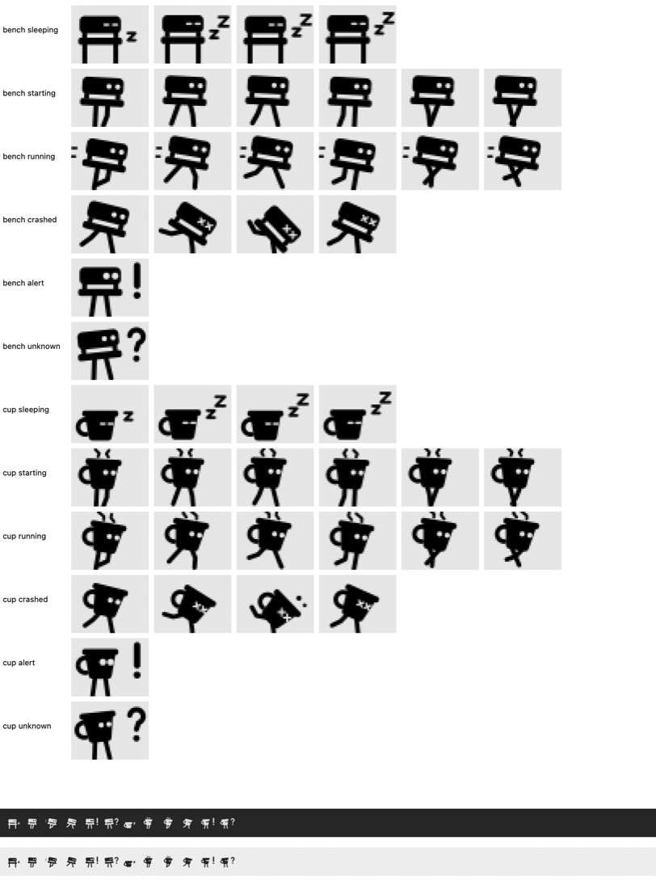
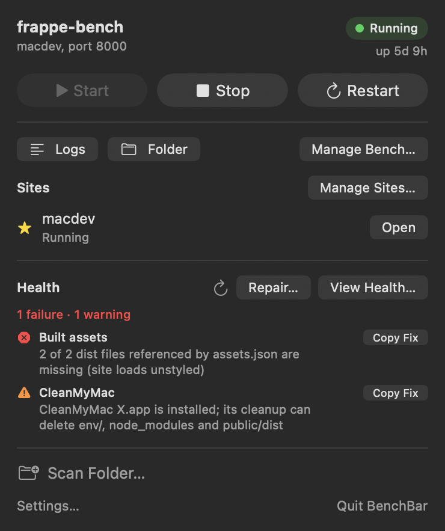
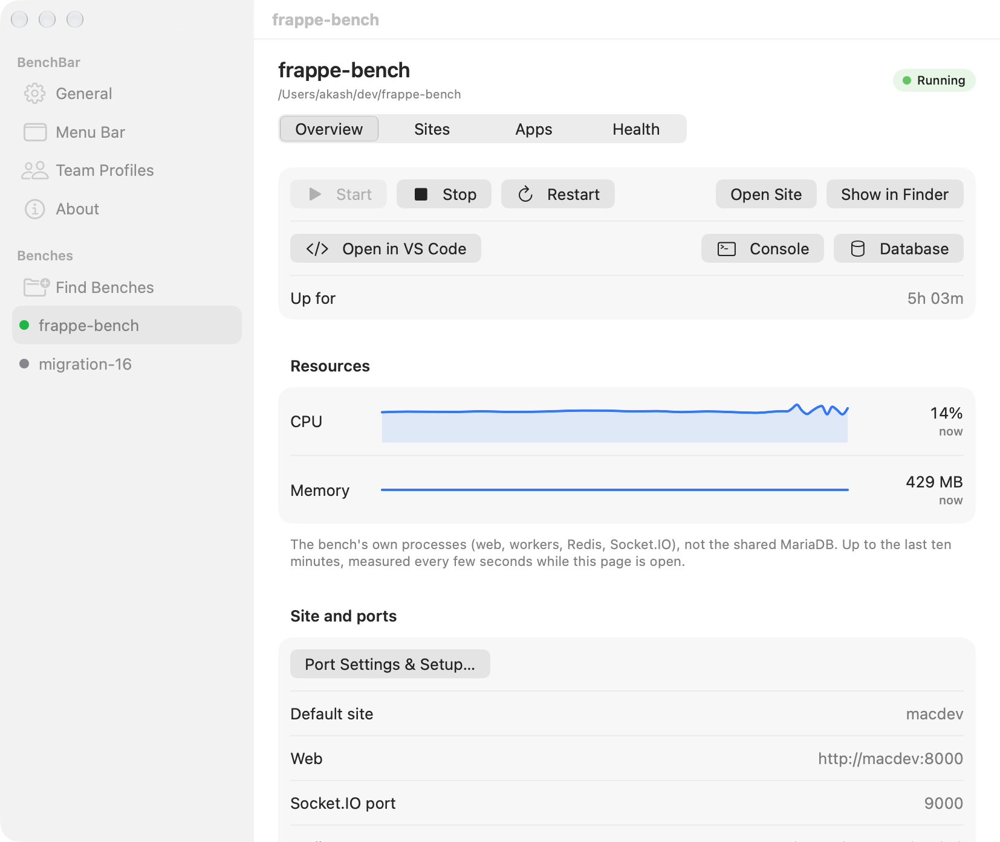
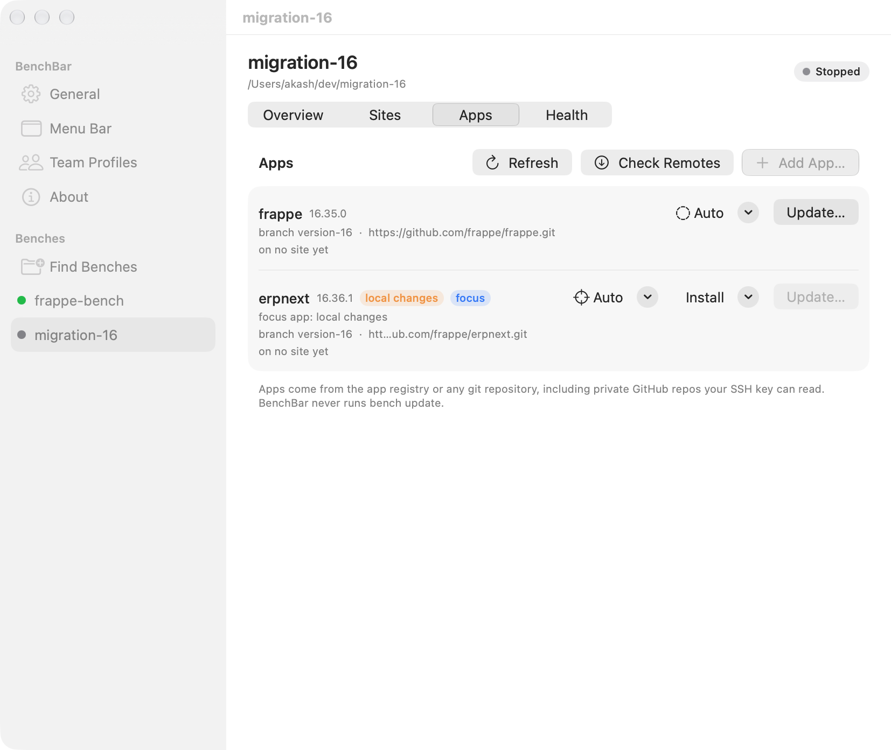
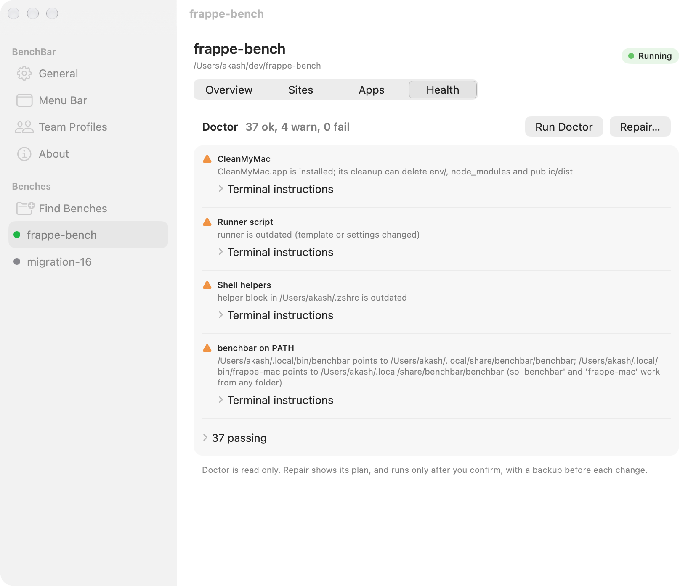
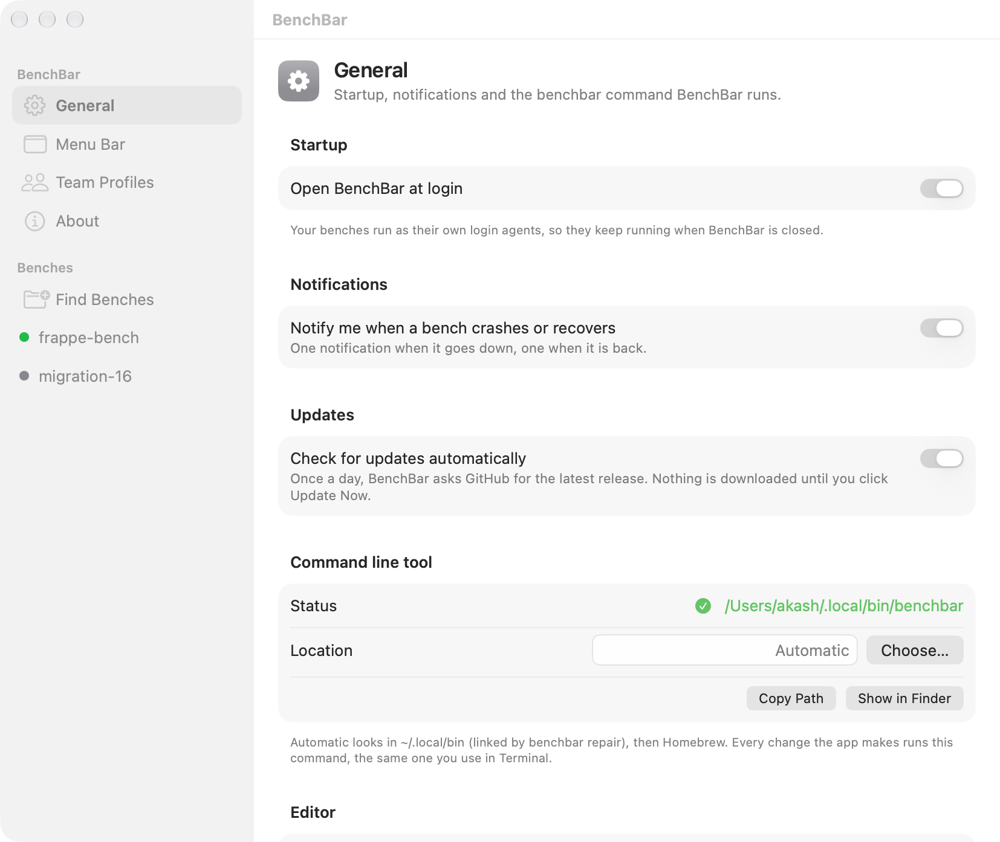

The BenchBar app lives in the menu bar. It shows every bench as a small
runner, and a window with a page per bench for its sites, apps and
health. It installs with the [one line installer](install.md) or from the
[DMG](install.md#the-app-from-the-dmg).

## The runner

The runner in the menu bar sleeps when the bench is stopped, walks while
it starts, runs while it is up (faster when the bench is busy), stumbles
when it crashes, and shows a question mark when the CLI is missing.
Reduce Motion shows still poses. With more than one bench it shows the
worst state of all of them.

BenchBar ships two runners, Bench and Coffee cup, and you can draw your
own: see [Custom runners](runners.md).

## The popover

Click the runner for the popover: bench, site, state and uptime, Start,
Stop and Restart, the logs and the bench folder, the bench's sites with
an Open button each, and a health summary: the first checks that need
attention with a Copy Fix button, Repair when something is repairable,
and a button to check again. With more than one bench a picker at the
top chooses which bench the popover shows.

### Keyboard shortcuts

| Keys | Action |
|---|---|
| ⌘U | Start |
| ⌘D | Stop |
| ⌘R | Restart |
| ⌘O | Open the site |
| ⌘L | Logs: a log window with search and a filter per process |
| ⌘F | Open the bench folder |
| ⌘K | Health in the BenchBar window |
| ⌘M | The BenchBar window |

## Links for Raycast and Shortcuts

`benchbar://up`, `down`, `restart`, `open`, `logs`, `window`, `doctor`,
`console`, `db` and `editor` act on a bench from Raycast, Shortcuts or a script, for example
`open "benchbar://restart?bench=frappe-bench"`. Links never repair,
install or delete anything. The [URL scheme](/reference/url-scheme/) page
has every route and ready to use Raycast and Shortcuts recipes.

## The BenchBar window

Open it with ⌘M, **Manage Bench…** in the popover, or by
opening BenchBar again from Finder or Spotlight. It has a page per bench:

- **Overview**: start, stop, restart, the site and ports, and the
  scheduler switch. **Open in VS Code** (or Cursor, chosen in Settings,
  General) opens the bench folder; **Console** and **Database** open
  Terminal with `benchbar console` and `benchbar db` for the default site.
  The ⋯ menu of each site on the Sites tab has both for that site. While the bench runs, two small charts show its CPU
  and memory for the last ten minutes (hover for the value at a moment);
  the popover shows the current values under the bench name. They count
  the bench's own processes, not the shared MariaDB, and are kept in
  memory only. A bench with a lockfile (`benchbar.toml`) shows **In
  sync** or **N differences** with the list, from `benchbar lock check`
  (read only); bring it in line with `benchbar lock apply` in Terminal.
- **Sites**: add a site (it asks for the Administrator password), make
  one the default, open any of them. The ⋯ menu of a site backs it up
  (with or without files) and shows the last backup in Finder; **Drop
  Site…** shows the plan, asks you to type the site name, and reports
  where bench put the backup. Removing the site's `/etc/hosts` line needs
  your password, so the sheet shows that command to run in Terminal.
- **Apps**: add an app from the registry or any GitHub URL, install it on
  a site, and update it after reading the changelog. Right click a bench
  in the sidebar for its actions.
- **Health**: doctor's checks, and Repair with its plan shown before
  anything changes and each step as it runs.

Above the benches:

- **General**: open at login, notifications, **Check for updates
  automatically**, which `benchbar` the app runs, the keyboard shortcuts.
- **Menu Bar**: the runner, with a live preview and custom runners, see
  [Custom runners](runners.md).
- **Team Profiles**: every profile with where it comes from (built in,
  local, imported, subscribed), a badge when a subscription is behind and
  a warning when another file with the same name hides one. **Import…**
  takes a `.toml` file or an https link (or drop the file on the page),
  **Subscribe…** a team's git repository of profiles. Each profile's ⋯
  menu has Export (pick each app's branch and which apps to share, then
  Copy Import Link), Update (shows the changes first), Check Access
  (which repositories your git credentials reach), Show in Finder and
  Remove (moves the file aside). Import and update show what changes
  before they write, and nothing is installed from this page. See
  [Teams](guides/teams.md#team-profiles).
- **About**: the versions, Check for Updates, Report a Bug.

## Updates

BenchBar asks GitHub for the latest release at most once a day, when it
starts, when the Mac wakes, and on an hourly look at the clock. The
check is one request to the GitHub API and downloads nothing. Turn it
off in General with **Check for updates automatically**; **Check for
Updates** in About and in the app menu still works. A build with Sparkle
(see [Releasing](releasing.md)) leaves the schedule to Sparkle.

When a newer release is out, the popover and the menu bar menu show
**Update to X…**, and the BenchBar window shows a banner with:

- **Update Now**: Terminal opens and runs the one line installer
  (`install.sh --yes`, or `--app-only` when your CLI is a git checkout of
  your own). BenchBar quits so the installer can replace it and opens
  again when it is done. Your benches keep running. The app writes a
  `.command` file for Terminal, so macOS asks for no Automation
  permission.
- **Copy Command**: the same command, to run yourself.
- **Release Notes**: the release page.

The close button on the banner hides it until the next version; the
menu item stays. See [Updating](install.md#updating) for what the
installer changes.

## First run

On first run the app looks for the CLI in `~/.local/bin/benchbar`, then in
Homebrew's folders, and asks once with a file picker if it finds none.
macOS asks whether BenchBar may send notifications; allow it for the
crash alerts.

## What the app does not do

The app does not write plists, edit bench files, or run `bench`, `brew`
or `launchctl`. Every button runs `benchbar ... --json` and reads the
answer, plus the state file the runner writes on every transition. That
JSON is a documented API: [JSON schema](json-schema.md).

## Find existing benches in a folder

Choose **Scan Folder…** in the menu bar popover (or its right-click menu),
then select a folder such as `~/Developer`. **Find Benches** in the window
keeps the results and offers **Choose Folder…** and **Scan Again**.

The scanner searches subfolders, up to six levels deep, until it finds a
bench. Hidden folders, symlinks, dependency/build folders, test/fixture
directories and macOS system and media folders (Library, Applications,
Pictures, Music, Movies, Volumes, System) are skipped. Unreadable subfolders,
including ones macOS privacy settings block, produce warnings alongside the
results. Cancel Scan
stops the search. No bench, service, site, or database is changed by scanning.

Review the full paths and sites, select benches, and click **Add Selected**.
The selection is remembered by the CLI and survives app restarts; aliases and
repeat scans do not add duplicates. Already-added benches are labelled.

Select benches and choose **Set Up Selected…** to review all current and proposed
addresses together with each bench’s service and hosts changes. Conflict labels identify overlapping configured ports. The
planner also checks live listeners, retains valid addresses where possible, and
shows blocked running benches. Stop those benches and disable their previous
automatic startup, or deselect them. Applying the preview configures management
through the existing adoption engine and remembers the benches; it does not start
them. Password-requiring hosts entries are reported for Terminal.

**Port Settings & Setup…** in Overview offers Automatic and Fixed mode. Fixed
pins the current ports. Saving a mode takes effect immediately but never moves
ports; address changes require applying a fresh preview. Automatic preserves
working allocations and proposes replacements for conflicts. Stopped managed
benches retain reservations for their current configuration; automatic mode
ignores outdated saved allocations after an external port change. If the configuration changes after preview,
BenchBar refuses the old plan and offers **Refresh Preview**.

Start and Restart check again before proceeding. A conflict exposes **Review
Port Conflict…**; review the proposed change and choose **Resolve & Start**.
For a fixed allocation that overlaps another bench’s claim, switch to Automatic
or reallocate the competing bench. Stopping it alone does not release its claim
for setup. CLI users can instead confirm a stopped overlap to run one bench at
a time without changing addresses.
BenchBar never stops an unrelated listener to obtain a port. Setup output retains
per-bench completion details if a later batch entry fails; completed entries stay
configured and the next preview reflects the actual state.

## Compact menu-bar controls

The popover is as tall as its content and scrolls only past a fixed cap,
so the footer stays reachable. An unmanaged bench offers **Set Up
Management…**, which opens its review only setup preview in the main
window. A port conflict similarly opens **Review Port Conflict…** there.

The popover shows up to three sites: the default site first, then any
site that still needs a hosts line, then the rest in name order (site-2
before site-10). **Manage Sites…**, or **View All** when there are more,
opens the complete Sites tab. A missing hosts line shows the `benchbar
site hosts` command with a Copy button, and **Set Up…** on the site.
Open is enabled once the bench is running.

Health shows the failure and warning counts and the first two checks
with their message and **Copy Fix**. **View Health…** (⌘K) has the full
report with passing checks and Terminal instructions. A failed refresh
is marked stale in the popover.
