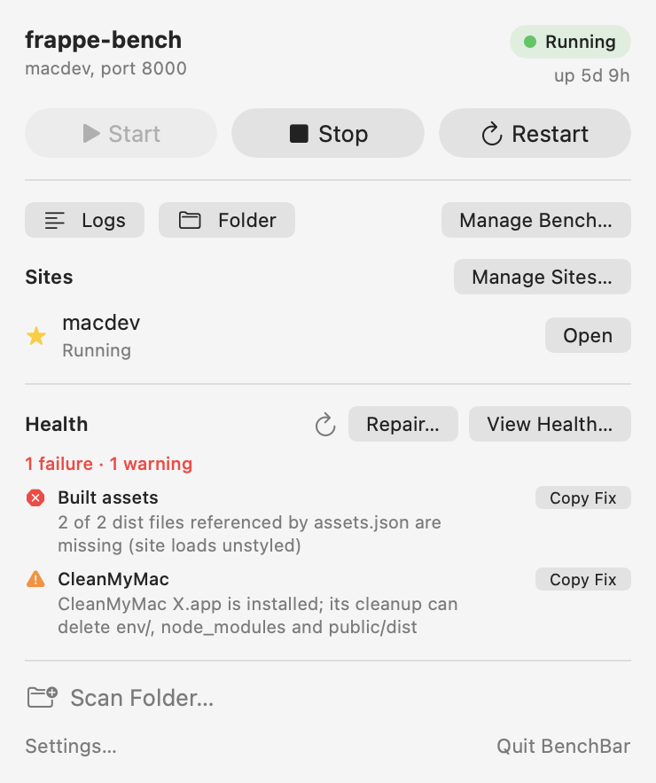

Local Frappe and ERPNext development benches on macOS. The `benchbar`
command line tool installs a bench, runs it in the background under
launchd and keeps it healthy. The BenchBar menu bar app shows each bench
as a small runner with start, stop and a health check one click away, and
a window for each bench's sites, apps and health.

New here? [Install](install.md) BenchBar, then follow the
[Quick start](quick-start.md). You have a bench already? The quick start
covers that too: `benchbar adopt` registers it without touching its apps,
sites or databases.

## Features

- **One command installs everything.** Homebrew formulae (Python, Node,
  MariaDB, Redis), a MariaDB root password kept in your Keychain, the
  patched Qt wkhtmltopdf, a bench and a site. Re-running it changes only
  what changed.
- **The bench runs in the background.** One launchd agent per bench. It
  survives closing Terminal, comes back after a reboot if it was running,
  restarts after a crash, and pauses with a notification after three
  crashes in ten minutes.
- **Doctor and repair.** `benchbar doctor` is read only and names the
  exact fix for each problem. `benchbar repair` applies only the flagged
  fixes, in order, with a backup before every change. See
  [Doctor and repair](guides/doctor-and-repair.md).
- **Existing benches welcome.** `benchbar adopt` registers a bench you
  already have without touching its apps, sites or databases. Only when
  its ports clash with another bench does it move them, after asking.
- **A menu bar app.** State at a glance, start, stop, restart, the site,
  the logs, a read only doctor, and crash notifications. The BenchBar
  window adds a page per bench: sites, apps, doctor and Repair. The app
  never writes to a bench itself; it runs the CLI and reads its JSON. It
  carries a CLI of its own version, so one update covers both. See
  [The menu bar app](app.md).
- **Several benches side by side.** A v15 and a v16 bench, each with its
  own ports, sites and scheduler, on one MariaDB. See
  [Benches and sites](guides/benches-and-sites.md).
- **Apps from anywhere.** From the app registry or any GitHub repository,
  private ones included (your SSH key or `gh` login), with a changelog
  before every update. See [Apps](guides/apps.md).
- **Made for teams.** A team profile sets up a new bench with your apps
  and branches; the `benchbar.toml` lockfile keeps everyone's bench the
  same; `benchbar pull` copies a production site into a local one, email
  muted and scheduler paused. See
  [Teams: profiles, lockfile and pull](guides/teams.md).
- **For coding agents.** `benchbar mcp` lets Claude Code, Cursor and
  other agents read and drive your benches. See
  [Coding agents and MCP](guides/agents.md).
- **Shell helpers.** `benchup`, `benchdown`, `benchrestart`,
  `benchstatus`, `benchlogs`, `benchwatch` and friends.
- **Bug reports without secrets.** `benchbar report` writes a redacted
  diagnostics zip.

## Requirements

- macOS 14 or later on Apple Silicon. On Intel Macs the CLI works and the
  app is skipped.
- Homebrew and the Xcode Command Line Tools. The installer offers both.
- About 5 GB of free disk under your home folder, and internet access.

No Docker, no VM, no preinstalled Python, Node, MariaDB or Redis.

## Safety

- Every command is check, plan, apply, verify. `--dry-run` prints the
  full plan and changes nothing. A second run says `unchanged`.
- Generated files carry a version and content hash header. They are
  rewritten only when their template or inputs changed, and the previous
  copy goes to `backups/<date>-<time>-<pid>/` in benchbar's state folder first
  (`~/.local/state/benchbar`; `benchbar where` shows it).
- `install`, `adopt`, `doctor` and `repair` never change your sites,
  databases, `apps/` or your own files; the one exception is the port
  keys in `sites/common_site_config.json` when a bench moves to a free
  port block, after asking and with a backup. Broken folders are moved
  aside, never removed.
- Commands that exist to change a site or an app ask first (`site drop`
  wants the site name typed again with `--confirm-site`) and back up
  first: `site drop` backs the site up with its files and then drops
  its database, `pull --replace`
  backs up the site it overwrites, `app update` backs up the sites that
  have the app. benchbar never deletes a whole bench.
- Stop and cleanup match only this bench's processes, including the
  listeners on its ports that run inside the bench folder. Another
  bench, an unrelated server, and your own `bench migrate` or `bench
  console` keep running.
- `sudo` is used for two things, lines in `/etc/hosts` and the
  wkhtmltopdf package, once per run and only after saying why.
- The MariaDB root password lives in the Keychain and reaches the client
  through `MYSQL_PWD`, never on a command line.
- Full logs of every mutating run: `logs/<date>-<time>-<pid>.log` in the same
  state folder.

## Documentation

- [Install](install.md): Homebrew, the one line installer, the DMG,
  building from source, moving to Homebrew, and uninstalling.
- [Quick start](quick-start.md): adopt a bench or install a new one.
- [Benches and sites](guides/benches-and-sites.md): daily use, sites,
  several benches, ports and the scheduler.
- [CLI reference](reference/cli/install.md): every command, flag and exit
  code, and [Configuration](reference/configuration.md): profiles,
  bundles, passwords and environment variables.
- [Troubleshooting](troubleshooting.md): common stumbles, the cleanup tool
  case, what recovers on its own, migrating from frappe-mac 0.2, what
  benchbar writes, wiping a bench.
- [Testing](testing.md): the ten minute guide for testers.
- [JSON schema](json-schema.md): the JSON the app and scripts read.
- [Runners](runners.md): custom runners for the menu bar.
- [Releasing](releasing.md): how releases are built and signed.
- [Decisions](DECISIONS.md): every non obvious choice, one line each.
- [AGENTS.md](../AGENTS.md): guidance for AI coding agents working on a
  bench.
- [CHANGELOG.md](../CHANGELOG.md) and the [Roadmap](../ROADMAP.md).

## License

MIT, see [LICENSE](../LICENSE). Frappe and ERPNext are trademarks of
Frappe Technologies; BenchBar is not affiliated with or endorsed by them.
